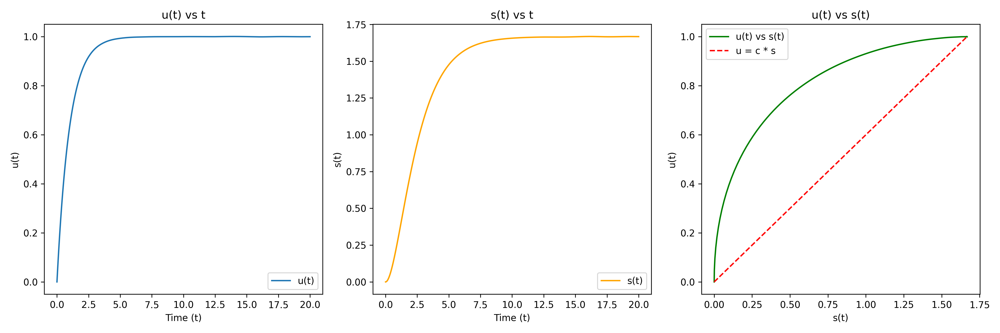
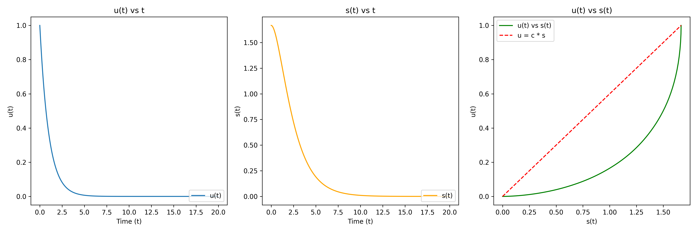
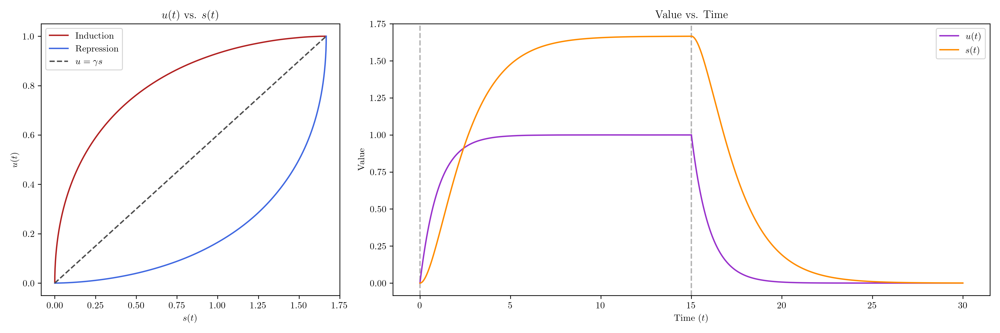
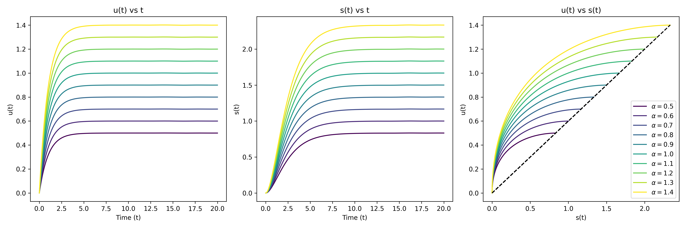
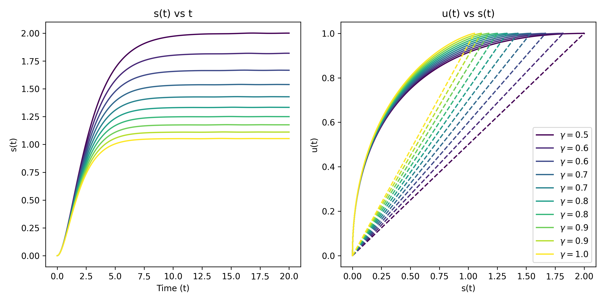

# RNA-velocity Review for Systems Biology

## To Do List
- [ ] Maybe add the mapping tools into the article.
- [ ] Different degradation rate!

## General Outline for the Review

1. Introduction
    - Point out the importance of trajectory inference in single-cell RNA-seq data analysis.
    - Point out the wide application of systems biology. 
    - Introduce the concept of RNA-velocity and its importance in trajectory inference.

1. RNA velocity is an excellent demonstration of using systems biology to solve biological problems.
    - The equation is very simple and is a very old idea in systems biology.
    - The equation fits the biological process very well.

1. RNA velocity software like scVelo can be used to infer the trajectory of the cells.
    - Coefficients can be inferred from the sequencing data.
    - The general process of velocity analysis.
1. The limitations of the RNA velocity method and possible improvements.
    - Number of unspliced reads will always be not-accurate.
    - Weird outputs in Chromaffin dataset.
    - Sigmoidal transcription velocity.
    - Some genes don't follow this pattern.
1. Conclusion

## The Nature of the Equations

$$ \frac{du}{dt} = \alpha - \beta u, \frac{ds}{dt} = \beta u - \gamma s $$

From the simple equations as shown above, three constant parameters (in velocyto's assumption) doesn't vary with time. By setting $\beta = 1$ as in the velocyto method, we can plot the phase portrait of the system under different $\alpha$ and $\gamma$ values.

When setting $\alpha = 1$, $\gamma = 0.6$ with initial value $(u_0, s_0) = (0,0)$, the phase portrait looks like this:

If we want to observe the inhibition or down-regulation process, we just need to set $\alpha = 0$, assuming the transcription is turned off in a very fast manner, and change the initial value to $(u_0, s_0) = (1, 5/3)$. We obtain the direct opposite graph. 

A combined graph showing the influence of $\alpha$ (i.e. Expression at $t = 0$ and inhibition at $t = 15$) on the level of unspliced and spliced RNA is shown below.

By setting $\gamma = 0.6$, we can plot all the different phase portraits with different $\alpha$ values.

By setting $\alpha = 1$, we can obtain all the different phase portraits with different $\gamma$ values. The $u(t)$ vs $t$ plot was not shown since alternating $\gamma$ values doesn't affect the $u(t)$ vs $t$ plot.

